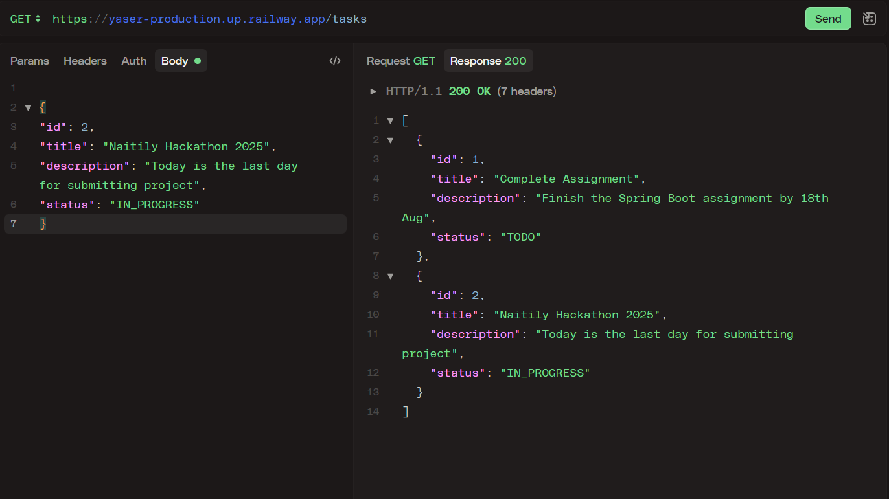
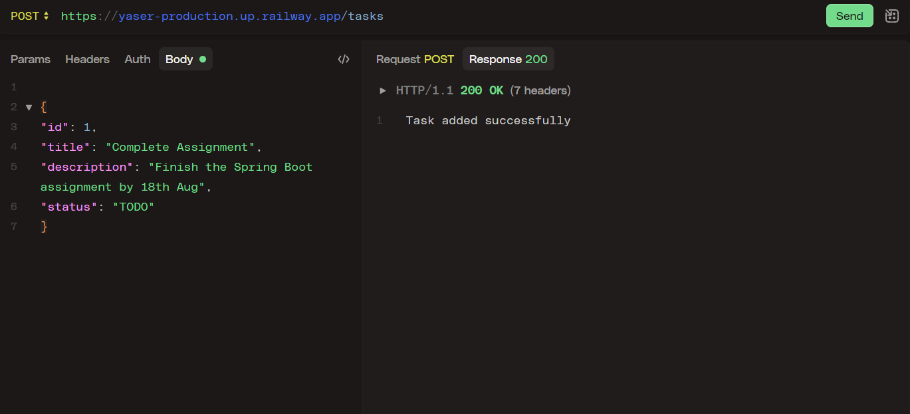
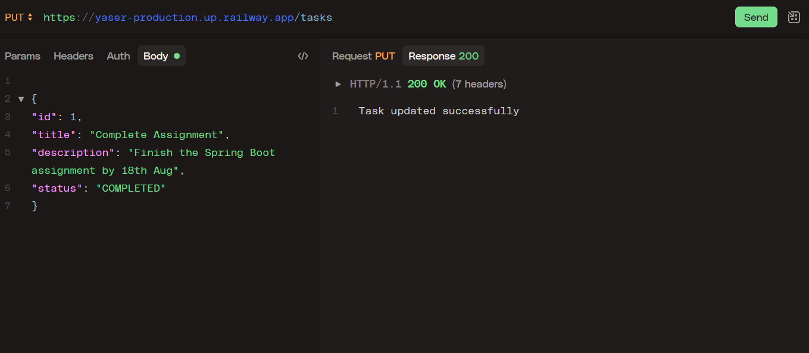
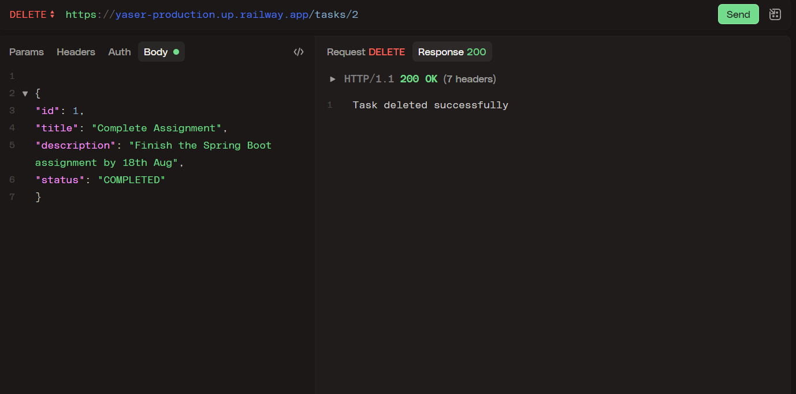

# Lords-Engineering-College-Bootcamp 🚀

This folder contains the final assignment for the Lords Engineering College Bootcamp. All required files and code are available here.
* **Name:** T Mohamed Yaser
* **Roll No:** 160923733104
* **Branch:** CSE-B1

---

> **Note:** The final assignment is available in this folder. All code, documentation, and required images are present as per the assignment instructions.

# Folder Structure
```
images/
    ├── Delete.png
    ├── Get.png
    ├── Post.png
    └── Put.png
src/
    └── main/
        ├── java/
            └── com/
                └── example/
                    └── demo/
                        ├── controller/
                            ├── StudentProfileController.java
                            └── TaskController.java
                        ├── internship/
                            └── student/
                                ├── Student.java
                                └── StudentTest.java
                        ├── models/
                            ├── Status.java
                            └── Task.java
                        ├── services/
                            ├── StudentProfileService.java
                            └── TaskService.java
                        ├── studentprofile/
                            └── StudentProfile.java
                        └── InternshipApplication.java
        └── resources/
            └── application.properties
pom.xml
README.md
```

# Task and Student Management API - Spring Boot Assignment

## How to Run

1.  Make sure you have Java 17+ and Maven installed.
2.  Open a terminal in the project root.
3.  Run:
    ```
    mvn clean spring-boot:run
    ```
4.  The **local API** will be available at `http://localhost:80`.
5.  The **live API** is available at `https://yaser-production.up.railway.app/`.

---

## Endpoints

### Task Endpoints

* `GET /tasks` — List all tasks
* `GET /tasks/{id}` — Get a task by ID
* `POST /tasks` — Add a new task
* `PUT /tasks` — Update a task
* `DELETE /tasks/{id}` — Delete a task

### Student Profile Endpoints

* `POST /studentprofile/create` — Create a new student profile
* `GET /studentprofile/{studentId}` — Get a student profile by ID
* `PUT /studentprofile/update` — Update a student profile
* `DELETE /studentprofile/{studentId}` — Delete a student profile
* `GET /studentprofile/all` — List all student profiles

---

## Example JSON for POST

### Task
````json

{
"id": 1,
"title": "Complete Assignment",
"description": "Finish the Spring Boot assignment by 18th Aug",
"status": "TODO"
}
````


### Student Profile
```json

{
"id": 1,
"rollNumber": "1234",
"name": "John Doe",
"email": "john.doe@example.com"
}

```

---

## Postman Test Outputs

Below are the outputs for each CRUD operation as tested in Postman:

### GET (Retrieve All Tasks)


### POST (Add New Task)


### PUT (Update Task)


### DELETE (Delete Task)


---

## Notes
* All logic is handled in the service layer using an `ArrayList` as a warehouse.
* Enum `Status` is used for task status.
* Standard package structure: `controller`, `services`, `models`, `images`.
* Constructor-based dependency injection is used.
* Tested with Postman.
